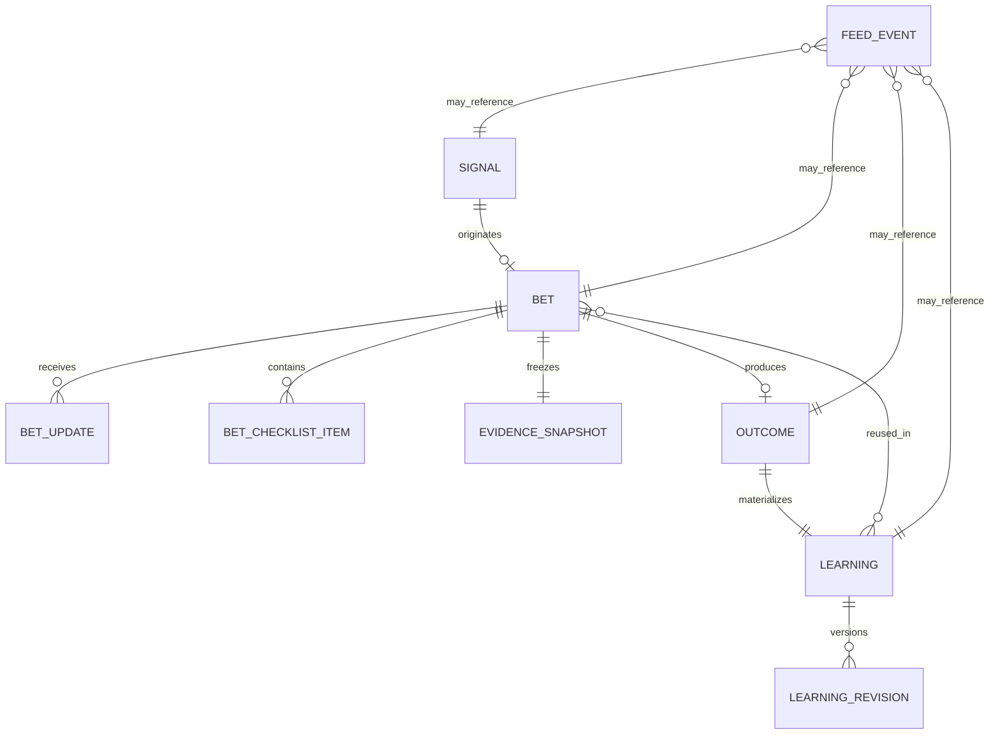

# Modelo de domínio — Loop de aprendizado Growth

**Versão:** 0.1
**Objetivo:** definir linguagem, estados, invariantes e transições antes do schema físico.

## 1. Agregados

### 1.1 Sinal

Uma observação sistêmica que pode exigir investigação ou decisão.

Campos conceituais:

- identidade;
- frente;
- entidade e escopo;
- métrica;
- padrão detectado;
- impacto;
- causa provável;
- evidências;
- limite de leitura;
- recomendação;
- confiança;
- severidade;
- prioridade;
- status.

Estados:

```text
new → reviewing → accepted
                 ├→ rejected
                 └→ merged
```

Invariantes:

- todo sinal tem ao menos uma evidência ou um bloqueio de qualidade explícito;
- `blocked` não pode gerar recomendação de escala/corte;
- texto livre não é chave de deduplicação;
- deduplicação usa produtor, entidade, código estável e janela.

### 1.2 Aposta

Uma decisão assumida para produzir ou testar uma mudança observável.

Campos conceituais:

- hipótese;
- ação;
- frente/escopo;
- time e owner opcional;
- baseline;
- métrica;
- expectativa;
- direção;
- critério de sucesso;
- prazo de execução;
- janela de verificação;
- condição de interrupção;
- evidência congelada;
- aprendizados consultados.

Estados:

```text
draft → approved → in_progress → waiting_window → ready_for_review → closed
  └→ cancelled       └→ cancelled         └→ not_verifiable
```

Uma aposta pode existir sem owner individual, mas precisa de `team_scope` ou frente responsável.

### 1.3 Registro de execução

Afirma o que realmente foi feito, quando e em qual escopo.

Não é inferido apenas pela passagem do tempo. Possui:

- estado `not_started | partial | completed | cancelled | unknown`;
- data;
- resumo;
- divergências em relação ao plano;
- referências;
- autor sistêmico ou humano da atualização.

### 1.4 Outcome

Resultado calculado quando a janela e a evidência permitem verificação.

Vereditos:

- `confirmed`;
- `partially_confirmed`;
- `not_confirmed`;
- `invalid_premise`;
- `execution_diverged`;
- `data_blocked`;
- `not_verifiable`.

Estados de revisão:

```text
pending_evaluation → system_evaluated → confirmed_by_user
                                  └→ contested → resolved
```

Invariantes:

- outcome não confunde ação não executada com hipótese refutada;
- missing não vira zero;
- mudança de regime pode invalidar a premissa;
- o veredito preserva a expectativa original;
- o observado aponta para snapshot/run verificável.

### 1.5 Aprendizado

Memória reutilizável com origem explícita. Pode ser derivada de um outcome revisado ou curada de uma decisão histórica do vault, sem confundir as duas procedências.

Origens:

- `outcome`: validada pelo ciclo `aposta → execução → outcome → revisão`;
- `vault_curated`: conhecimento histórico governado, rastreado até uma nota-fonte, mas não validado pelo loop atual.

Classificações:

- `confirmed`;
- `directional`;
- `contradictory`;
- `inconclusive`;
- `invalidated`.

Estados de ciclo de vida:

```text
active → expired
   ├→ superseded
   └→ contested
```

Todo aprendizado possui:

- afirmação;
- escopo;
- condições de aplicabilidade;
- limitações;
- confiança;
- evidências;
- outcomes de origem;
- origem e referência documental;
- regime;
- `valid_from`;
- `review_at` obrigatório;
- `valid_until` quando aplicável;
- relação de substituição/contradição.

### 1.6 Evento de feed

Registro append-only de uma mudança relevante em um objeto do loop.

O evento não substitui o objeto nem reconstrói seu estado. Ele preserva:

- tipo;
- sujeito;
- instante;
- frente;
- prioridade;
- dimensões de relevância;
- snapshot textual/visual do post;
- rota de destino.

### 1.7 Projeção Report Live

Seleciona objetos do loop para um perfil editorial sem alterar os objetos de origem.

Exemplos:

- apostas abertas no período;
- outcomes encerrados;
- aprendizados materializados;
- bloqueios de qualidade;
- versão candidata/publicada.

## 2. Relações



## 3. Registro de crença

No instante da aprovação, a aposta congela:

- hipótese;
- baseline;
- expectativa;
- alternativas conhecidas;
- evidência usada;
- limitações;
- aprendizados consultados;
- versão das regras.

Esses campos não são sobrescritos pelo resultado. Correções posteriores criam revisão, preservando o registro original.

## 4. Single-loop e double-loop

### Single-loop

Outcome altera a próxima ação sem mudar objetivo/regra.

### Double-loop

Outcome classificado como premissa inválida, mudança de regime ou contradição pode:

- expirar aprendizado;
- substituir regra contextual;
- contestar métrica;
- exigir nova definição de escopo;
- abrir sinal de qualidade/medição.

## 5. Materialização automática da memória

Após o outcome chegar a `confirmed_by_user` ou `resolved`, o sistema:

1. cria aprendizado se ainda não existir;
2. classifica a partir do veredito;
3. define `review_at` conforme volatilidade;
4. liga evidências e outcome;
5. gera evento `learning_created`;
6. disponibiliza o aprendizado para recuperação futura.

Não existe botão humano “promover para memória” no primeiro corte.

Conhecimento histórico pode ser importado separadamente como `vault_curated`. Ele deve carregar fonte, escopo, limitações, vigência e revisão, e a interface deve distingui-lo visualmente de uma memória originada por outcome.

## 6. Correção via LLM/Supabase

Uma alteração deve:

- criar `learning_revision`;
- registrar motivo;
- apontar revisão anterior;
- preservar evidências;
- recalcular vigência quando necessário;
- gerar evento de feed apenas se a mudança for material.

Update destrutivo do texto sem histórico viola o contrato.

## 7. Reutilização

Antes de criar/aprovar aposta, o sistema consulta memórias por:

1. vigência;
2. frente;
3. métrica;
4. entidade;
5. parceiro;
6. canal;
7. segmento;
8. regime.

Recuperação determinística antecede qualquer busca semântica.
