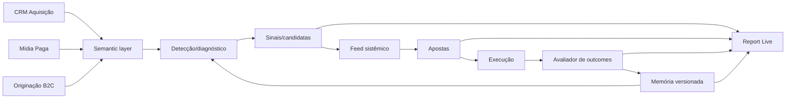

# SDD — Workspace Aprendizado Growth

**Versão:** 0.1
**Status:** arquitetura planejada; sem implementação

## 1. Objetivo técnico

Introduzir no GaaS um monólito modular que opere o ciclo `sinal → aposta → outcome → memória`, use o feed como interface principal e trate o Report Live como output editorial.

## 2. Restrições

- preservar o pipeline imutável/certificado do Report Live;
- não mover cálculo de métricas para o frontend;
- não criar outro produtor de outcomes concorrente;
- não transformar missing em zero;
- não alterar renderers nesta iniciativa;
- não criar microserviços;
- não incluir nova frente de segurança/RBAC.

## 3. Arquitetura



## 4. Frontend

Estrutura proposta:

```text
src/modules/growth-learning/
├── GrowthLearningWorkspace.tsx
├── growthLearning.types.ts
├── growthLearning.routes.ts
├── components/
│   ├── LearningHeader.tsx
│   ├── LearningFilters.tsx
│   ├── FeedView.tsx
│   ├── FeedCard.tsx
│   ├── FeedCardRegistry.tsx
│   ├── SignalDrawer.tsx
│   ├── BetsView.tsx
│   ├── BetDrawer.tsx
│   ├── OutcomesView.tsx
│   ├── OutcomeDrawer.tsx
│   ├── MemoryView.tsx
│   ├── LearningDrawer.tsx
│   └── ReportLiveWorkspace.tsx
├── hooks/
│   ├── useGrowthFeed.ts
│   ├── useGrowthBets.ts
│   ├── useGrowthOutcomes.ts
│   ├── useGrowthMemory.ts
│   └── useGrowthLearningFilters.ts
└── services/
    └── growthLearningService.ts
```

### Integração com `RelatorioView`

Adicionar modo `learning`, preferencialmente migrando a seleção para query string. O componente pai não conhece detalhes de feed/aposta/outcome.

### Registry de cards

`FeedCardRegistry` mapeia `event_type` para variante visual e ação. Evita condicionais espalhadas no feed.

## 5. Backend

### Commands

- `accept_signal_as_bet`;
- `reject_signal`;
- `update_bet`;
- `append_bet_update`;
- `set_checklist_item`;
- `record_execution`;
- `evaluate_due_outcomes`;
- `confirm_outcome`;
- `contest_outcome`;
- `resolve_contested_outcome`;
- `materialize_learning`;
- `revise_learning`;
- `link_learning_to_bet`.

Commands podem ser RPCs/funções ou rotas internas do backend existente. Evitar CRUD direto distribuído pelos componentes.

### Queries

O frontend consome views orientadas à tela descritas no modelo de dados.

### Avaliador

O avaliador existente do Report Live continua sendo a base quantitativa. Ele será extraído para uma função de domínio reutilizável, sem duplicar `expected_direction`, janela ou semântica de missing.

## 6. Feed

Feed baseado em eventos persistidos, não em texto gerado na consulta.

Fluxo:

```text
command/domain event
→ objeto atualizado
→ feed event persistido
→ view de feed
→ card registry
```

O snapshot do card pode conter prosa sistêmica, mas todos os números apontam para evidência determinística.

## 7. Integração transversal

Overview, Diário, Mensal e módulos de funil poderão emitir deep-link com:

- frente;
- período;
- filtros;
- entidade;
- métrica;
- referência visual.

A ação `Criar aposta` cria snapshot e navega para o drawer da nova aposta. O primeiro release pode restringir essa entrada ao feed; a integração transversal entra depois do loop básico.

## 8. Outcome e scheduler

Uma rotina periódica:

1. seleciona apostas com janela encerrada;
2. exclui/categoriza execução ausente;
3. resolve evidência congelada e view de verificação;
4. calcula veredito;
5. persiste outcome;
6. emite `outcome_evaluated`;
7. aguarda confirmação/contestação.

Após resolução, materializa aprendizado e `learning_created`.

## 9. Memória aplicável

Query inicial é determinística:

- vigente;
- mesma frente;
- mesma métrica;
- interseção de escopo;
- regime compatível;
- não substituída.

Ranking semântico fica fora do MVP.

## 10. Report Live

O pipeline de build/certificação/publicação não muda. Apenas:

- controles são movidos para o workspace;
- componentes de consumo ficam em Relatórios;
- projeções futuras podem incluir objetos do loop;
- eventos materiais do pipeline alimentam o feed.

## 11. Observabilidade de produto

Eventos:

- `growth_feed_opened`;
- `growth_signal_opened`;
- `growth_signal_accepted`;
- `growth_signal_rejected`;
- `growth_bet_created`;
- `growth_bet_started`;
- `growth_execution_recorded`;
- `growth_outcome_due`;
- `growth_outcome_reviewed`;
- `growth_learning_created`;
- `growth_learning_reused`;
- `report_live_candidate_generated`;
- `report_live_published`.

## 12. Ordem de construção

1. navegação e separação do Report Live;
2. feed read-only com eventos existentes;
3. sinal → aposta;
4. execução/checklist/timeline;
5. outcome e revisão;
6. materialização da memória;
7. reuso;
8. integração transversal e projeção editorial.
